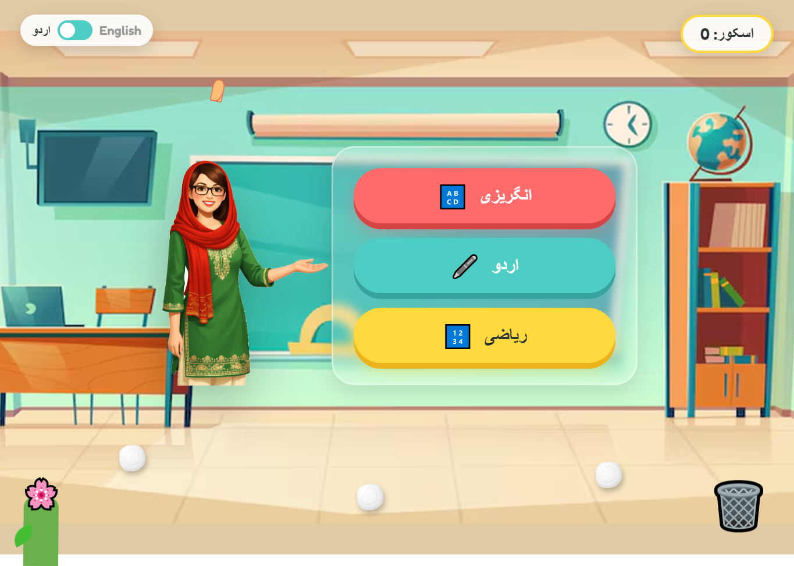

# Classroom Design

## Description
An interactive, bilingual classroom learning environment built with HTML, CSS, and Vanilla JavaScript. The application features a dynamic teacher character whose pose and speech bubble change when hovering over different subject boxes. It also includes an engaging mini-game where users can drag and drop scattered paper balls into a dustbin to earn points, promoting a clean classroom environment.

## Features
- **Bilingual Interface**: Seamlessly toggle between English and Urdu languages, updating all text on the board and speech bubbles.
- **Interactive Teacher**: The teacher updates her pointing pose and speaks encouraging messages via a dynamic speech bubble depending on the hovered subject.
- **Clean-up Mini-Game**: Interactive drag-and-drop mechanics allowing users to clean up paper balls. Successfully throwing them in the dustbin increments the score and triggers an eating animation and encouraging feedback. Full support for both mouse and touch devices.
- **Playful Animations**: Includes child-friendly aesthetic details like a floating teacher, swaying plants, and a beautifully animated 3D-fluttering butterfly.

## Screenshot

## Technologies Used
- HTML5
- CSS3 (Variables, Flexbox, Keyframe Animations, Glassmorphism, 3D Transforms)
- JavaScript (Vanilla, DOM Manipulation, Drag-and-Drop, Touch Events)

## Key JavaScript Functions
- `toggleLanguage()`: Switches the interface language between English and Urdu, dynamically updating text content across the application.
- `changeTeacher(position, subject)`: Updates the teacher's image source (pose) and speech bubble text depending on the targeted subject.
- `resetTeacher()`: Resets the teacher's pose back to the default position and reverts the speech bubble message.
- `moveBall(clientX, clientY)` & `releaseBall()`: Core handlers for the paper ball drag-and-drop mechanics, including touch and mouse tracking, boundary checking, and collision detection with the dustbin.

## Core CSS Components
- **Variables (`:root`)**: Centralized custom properties for colors, dimensions, and layout offsets to easily customize the theme.
- **Board & Subject Boxes**: Glassmorphism effect (`backdrop-filter`) for the main board, and interactive 3D subject boxes with distinct colors, shadows, and hover/active transitions.
- **Animations (`@keyframes`)**: Extensive use of animations such as `float` (for the teacher), `sway` and `wobble` (for the plant), `eatAnimation` (for the dustbin), and `flutterPath`/`flapLeft`/`flapRight` (for the butterfly path and wing flaps).
- **Drag & Drop Styling**: Distinct visual cues for draggable elements, such as `cursor: grab` changing to `grabbing` during interaction.

## How to Run
Open the `index.html` file in any modern web browser to start exploring the interactive classroom. No build step or local server is strictly required.
